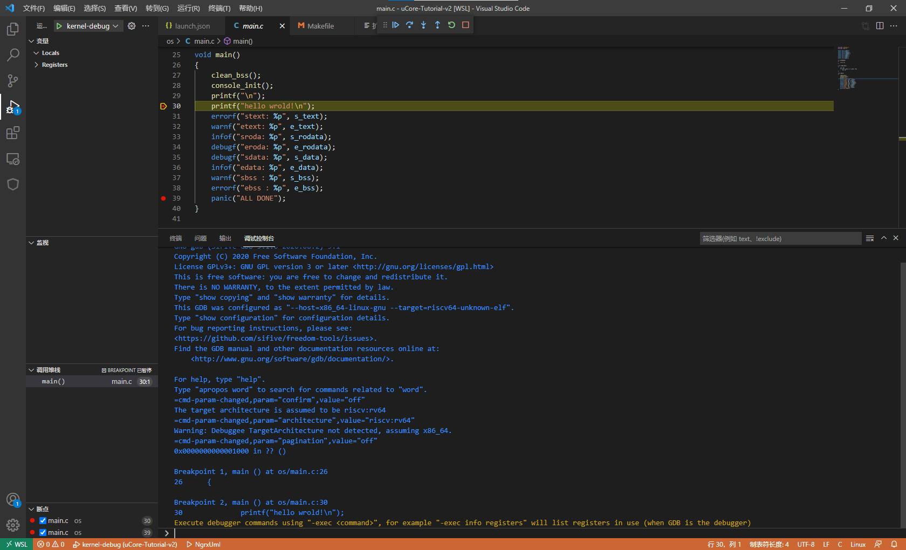

### GDB调试

在vscode下使用GDB调试ucore-tutorial的方式如下（以WSL2为例）：

首先编辑vscode的GDB配置文件，添加如下内容（需要安装vscode的C/C++的对应扩展）：

```json
//launch.json
{
            "name": "kernel-debug",
            "type": "cppdbg",
            "request": "launch",
            "miDebuggerServerAddress": "localhost:1234",
            "program": "${workspaceFolder}/build/kernel",
            "args": [],
            "stopAtEntry": false,
            "cwd": "${workspaceFolder}",
            "environment": [],
            "externalConsole": false,
            "logging": {
                "engineLogging": false
            },
            "MIMode": "gdb",
            "miDebuggerPath": "/usr/bin/riscv64-unknown-elf-gdb"
}
```

编译OS并在后台启动kernel：

```bash
make build
qemu-system-riscv64 -nographic -machine virt -bios ./bootloader/rustsbi-qemu.bin -kernel build/kernel -s -S
```

此时命令行进入等待状态。启动vscode的debug模式，选择调试配置为kernel-debug，在代码中设置断点后，即可开始运行。此时，命令行输出如下：


GDB命令输入输出可以从调试控制台（console）中看到：



调试成功。